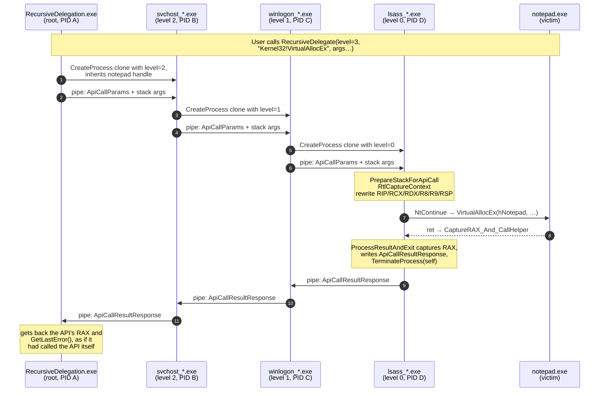
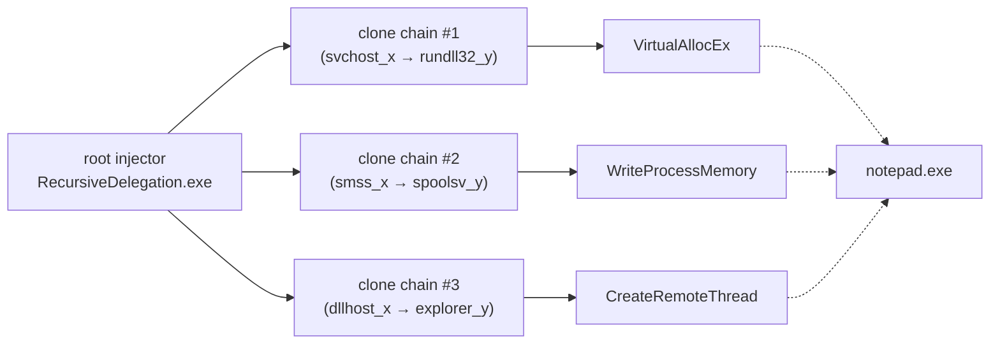

# RecursiveDelegation

> **Offensive-security PoC.** A Windows x64 process-injection technique that splits a single
> `VirtualAllocEx → WriteProcessMemory → CreateRemoteThread` chain across an arbitrary number of
> ephemeral child processes — each one a self-copy with a random Microsoft-binary-looking name —
> so that no single PID makes more than one cross-process Win32 call. The actual API is executed
> by warping a thread's `CONTEXT` into the target function via `NtContinue`, with a hand-built
> stack and an assembly stub that captures `RAX`.

## ⚠️ For research only

This project is a study of how attribution gets harder when an attacker spreads a kill chain
across many short-lived processes. Do not run it against systems you don't own. Don't ship the
clone-naming trick in anything that touches a real target. Etc.

---

## What it does, in one breath

1. The injector opens an **inheritable** handle to the victim (`notepad.exe`).
2. To invoke any cross-process Win32 API (say, `VirtualAllocEx`) the injector calls
   `RecursiveDelegate(level, params, …)`.
3. `RecursiveDelegate` clones the running EXE to a randomly named sibling file
   (`svchost_<tickcount>.exe`, `winlogon_<tickcount>.exe`, …), spawns it with the inheritable
   handle and a level-decremented command line, and sets up a named pipe.
4. The child does the same thing at one lower level. The chain unwinds until **level 0**.
5. The level-0 child receives the API parameters over the pipe, builds a fake stack with
   `PrepareStackForApiCall`, captures its own `CONTEXT` with `RtlCaptureContext`, rewrites
   `RIP/RCX/RDX/R8/R9/RSP` to point at the target API + its arguments, and calls `NtContinue`.
6. `NtContinue` "warps" the thread into the target API. When the API returns, it rets into an
   assembly stub `CaptureRAX_And_CallHelper` which moves `RAX` into `RCX` and calls
   `ProcessResultAndExit`. That helper writes the result back up the pipe chain and
   `TerminateProcess`'s its own host.
7. Each parent reads the result from its pipe and forwards it up. The original injector sees the
   API's return value as if it had called the API directly — except *a different process made
   each call*.

End result: for the full DLL/shellcode injection sequence
(`VirtualAllocEx → WriteProcessMemory → CreateRemoteThread`), **three independent delegation
chains** are spawned. Each cross-process API originates from a different ephemeral PID with a
different masquerading image name. A defender looking at a single process's API call history
sees one call against `notepad.exe`, not three; the attribution is intentionally diffused.

---

## How a single API call flows



The full DLL/shellcode injection runs this whole flow **three times** — once each for
`VirtualAllocEx`, `WriteProcessMemory`, and `CreateRemoteThread` — with three fresh clone
chains. No clone process makes more than one cross-process API call in its life.



---

## Repository layout

```
RecursiveDelegation/                 ← the EXE project (MSBuild + MASM)
  RecursiveDelegation.cpp            main(), demos, --inject-notepad / --inject-dll / --selftest
  RecursiveDelegationCore.h          shared structs + helper declarations
  RecursiveDelegationCore.cpp        ResolveFunction, CreateIPCPipe, CreateCloneExecutable,
                                     FindProcessPid, PrepareStackForApiCall, …
  RecursiveDelegationEngine.cpp      RecursiveDelegate, ExecuteApiCallAtLevelZero,
                                     ProcessChildMode, ProcessResultAndExit
  CaptureStub.asm                    assembly stub that captures RAX from the warped API

ClassicInjectRemoteThread/           reference: plain OpenProcess + VAE + WPM + CRT
ContextFunctionCall/                 reference: CONTEXT-based call into one API
ContextFunctionCallNtContinue/       reference: NtContinue-based call (predecessor to this PoC)

tests/                               GoogleTest suite (CMake + FetchContent)
  CMakeLists.txt                     pulls gtest 1.14.0, builds rd_core static lib + test EXE
  test_core.cpp                      27 tests across L1 (helpers), L2 (pipe wire format),
                                     L3 (real end-to-end delegation through child processes)
  README.md                          test-specific build / run notes

tools/                               PowerShell tracing + demo tooling
  Watch-InjectionEvents.ps1          live tail (admin) — NT Kernel Logger + Sysmon
  Capture-DelegationTrace.ps1        one-shot kernel ETW capture, decode, report
  Capture-SysmonInjection.ps1        one-shot Sysmon-log report for a single run
  Run-InjectionDemo.ps1              programmatic harness: inject + verify MessageBox owner
```

---

## Build

### The EXE (Visual Studio / MSBuild)

```powershell
msbuild RecursiveDelegation\RecursiveDelegation.vcxproj /p:Configuration=Debug /p:Platform=x64
```

Produces `RecursiveDelegation\x64\Debug\RecursiveDelegation.exe`.

### The tests (CMake; uses the CMake bundled with Visual Studio 2022)

```powershell
$cmake = "C:\Program Files\Microsoft Visual Studio\2022\Community\Common7\IDE\CommonExtensions\Microsoft\CMake\CMake\bin\cmake.exe"
& $cmake -S tests -B build\tests -G "Visual Studio 17 2022" -A x64
& $cmake --build build\tests --config Debug
```

First configure downloads GoogleTest 1.14.0 via `FetchContent`.

---

## Run

### Self-test (delegation through clones to harmless self-target APIs)

```powershell
.\RecursiveDelegation\x64\Debug\RecursiveDelegation.exe --selftest
```

### Shellcode-into-notepad demo (the visible one — pops MessageBox in notepad)

```powershell
Start-Process notepad.exe                                           # ensure notepad is running
.\RecursiveDelegation\x64\Debug\RecursiveDelegation.exe --inject-notepad 2
```

The `2` is the recursion depth (root → 2 clones → executor). The MessageBox titled `Injected`
appears inside notepad's window.

### LoadLibrary-DLL-into-notepad demo

```powershell
.\RecursiveDelegation\x64\Debug\RecursiveDelegation.exe --inject-dll 2
```

(Edit `dllPath` in `InjectDllToNotepadTest` first — currently hard-coded to a path on the
author's machine.)

### Run the test suite

```powershell
.\build\tests\Debug\rd_core_tests.exe
# or quiet mode:
.\build\tests\Debug\rd_core_tests.exe --gtest_brief=1
```

27 tests across 9 suites:

| Layer | Suites | Notes |
|---|---|---|
| **1 — pure helpers** | `GenerateRandomBinaryName`, `ResolveFunction`, `PrepareStackForApiCall`, `CreateCloneExecutable`, `FindProcessPid`, `CreateIPCPipe`, `ApiCallStructs` | No external state |
| **2 — IPC wire format** | `IpcWireFormat` | Full round-trip of `ApiCallParams` + var-length stack args + `ApiCallResultResponse` over a real named pipe between two threads. Includes the "client closes early" failure path. |
| **3 — E2E delegation** | `E2EDelegation` | Spawns the test EXE as its own child. Asserts: `GetTickCount64` falls in the host window, `VirtualAllocEx` at depth 1 and 2 produces a `MEM_COMMIT` region the parent can `VirtualQuery`, and a delegated `SetEvent` actually signals an inheritable event. |

---

## Per-API process attribution (verify it really did spread across processes)

Three trace tools, each useful for a different audience.

### `tools\Watch-InjectionEvents.ps1` — live, admin

Combines two sources so all three injection APIs are attributed in real time:

* **NT Kernel Logger** with the `(process,thread,virtalloc)` flags emits the
  `PageFault/VirtualAlloc` MOF event (caller PID in `System.Execution.ProcessID`, target PID in
  `Data['ProcessId']`) and `Thread/Start` (CreateRemoteThread at the kernel level).
* **Microsoft-Windows-Sysmon/Operational** EID 1 (ProcessCreate), EID 8 (CreateRemoteThread —
  cleanest, with source/target image names and start-function info), EID 10 (ProcessAccess —
  only if your Sysmon config doesn't filter it).

In one Administrator PowerShell:

```powershell
.\tools\Watch-InjectionEvents.ps1
```

Output is colour-coded:

```
[SYS-1]  ProcessCreate    PID 8060 <- parent ...  RecursiveDelegation.exe
[SYS-1]  ProcessCreate    PID 45856 <- parent 8060  mmc_3272565593.exe
[SYS-1]  ProcessCreate    PID 34488 <- parent 45856  rundll32_3272565609.exe
[ETW-VA] VirtualAlloc cross-process (== VirtualAllocEx)
         Source : rundll32_3272565609 (PID 34488)
         Target : notepad (PID 12916)
         Base   : 0x00000268DDAD0000  Size: 0x59
[SYS-1]  ProcessCreate    PID 17620 <- parent 27924  explorer_3272565750.exe
[SYS-8]  CreateRemoteThread!
         Source : explorer_3272565750.exe (PID 17620)
         Target : notepad.exe (PID 12916)
         Start  : 0x00000268DDAD0000  (-!-)
```

In another shell:

```powershell
.\RecursiveDelegation\x64\Debug\RecursiveDelegation.exe --inject-notepad 2
```

Different source PID for the `VirtualAllocEx` line vs the `CreateRemoteThread` line. That's the
proof.

### `tools\Capture-DelegationTrace.ps1` — one-shot kernel-ETW capture

Same NT Kernel Logger as above but as a one-shot: starts a session, runs the injector, stops,
decodes the `.etl` with `tracerpt`, and prints all VirtualAlloc + Thread Start events whose
target is notepad. Useful when you want a post-mortem report instead of a live tail.

### `tools\Capture-SysmonInjection.ps1` — one-shot Sysmon report

Runs the injection inside a time window and prints all EID 1 / 8 / 10 events from
`Microsoft-Windows-Sysmon/Operational` in that window.

### `tools\Run-InjectionDemo.ps1` — programmatic verification

Launches notepad if needed, runs the injector, uses `EnumWindows` to find the `Injected`
MessageBox, asserts its owner is notepad, parses the injector's own stdout to reconstruct
per-API process attribution, and reports `PASS` / `FAIL` per assertion. Useful in CI-ish
contexts.

---

## What you can and can't see in standard ETW

| API | Source of truth | Tool | Notes |
|---|---|---|---|
| `VirtualAllocEx` | NT Kernel Logger `PageFault/VirtualAlloc` MOF event | `Watch-InjectionEvents.ps1` → `[ETW-VA]`, `Capture-DelegationTrace.ps1` | Caller PID + target PID, base, size |
| `CreateRemoteThread` | Sysmon EID 8 **and** NT Kernel Logger `Thread/Start` | `Watch-InjectionEvents.ps1` → `[SYS-8]`, `[ETW-CT]` | Sysmon gives start address + module + function as a bonus |
| `WriteProcessMemory` | *No public ETW event.* `Microsoft-Windows-Threat-Intelligence` event 15 (`TgrWriteVirtualMemory`) is the only direct source but requires PPL-AM (anti-malware) protection to attach. | (inferred) | Sysmon EID 1 ProcessCreate captures the clone's full command line — including the API name it was spawned to execute — so the clone PID that performed WPM is identifiable from the chain. |
| `OpenProcess` | Sysmon EID 10 (`ProcessAccess`) | `Watch-InjectionEvents.ps1` → `[SYS-10]` | Many public Sysmon configs filter EID 10 to reduce noise. |

The WriteProcessMemory blind spot is **a property of stock ETW**, not of this PoC's design — no
arrangement of providers exposed to non-PPL callers logs the operation directly. The closest
indirect signal is the clone's command-line in Sysmon EID 1.

---

## Acknowledgements / related work

* The thread-warp-via-NtContinue trick is described in many places; see
  `ContextFunctionCallNtContinue/` for the single-API version that this project extends.
* The "spread the kill chain across N processes" idea generalises classic
  `OpenProcess + VAE + WPM + CRT` injection (see `ClassicInjectRemoteThread/` for that baseline).
